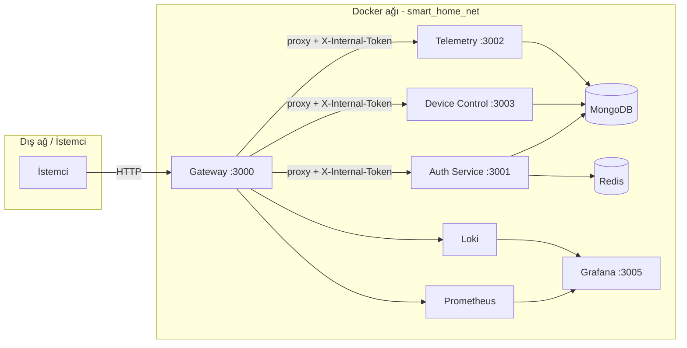
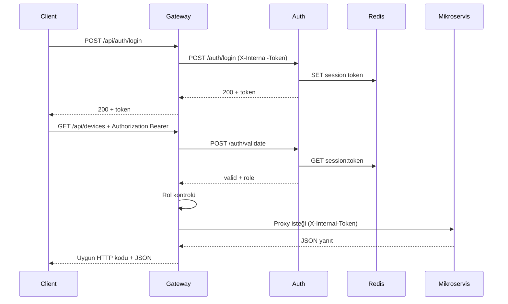
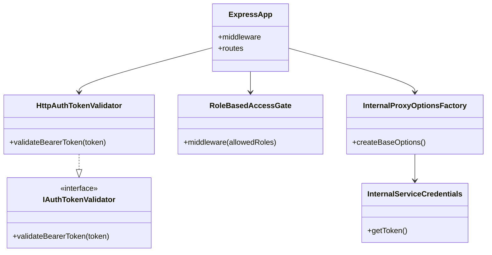
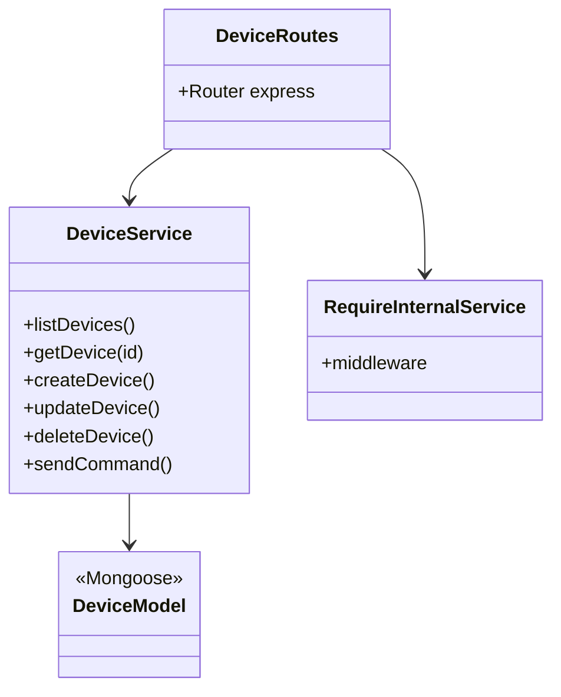
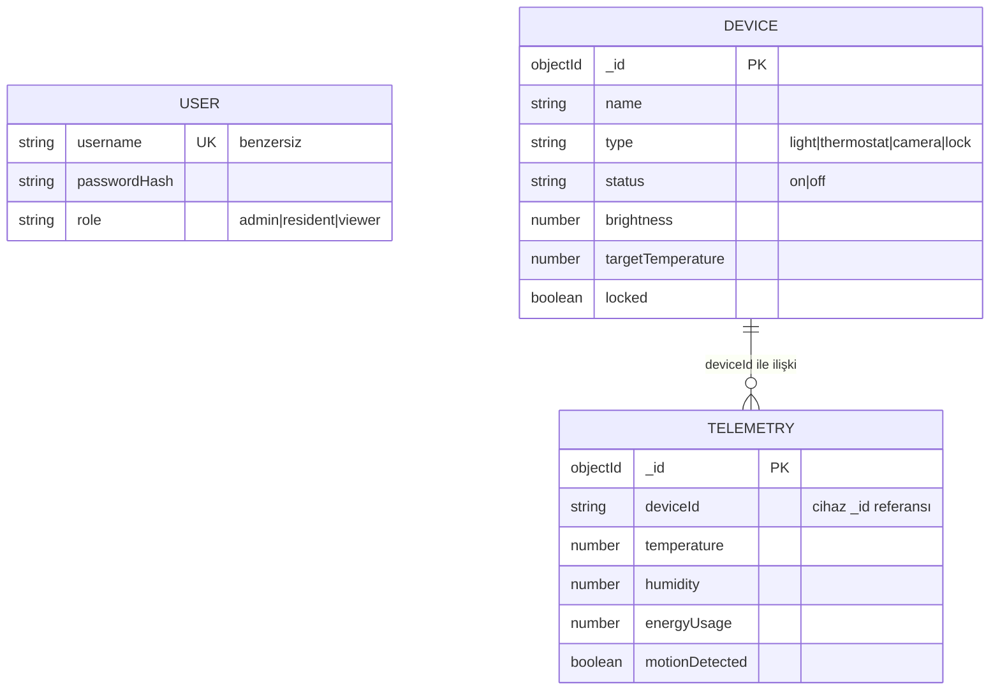
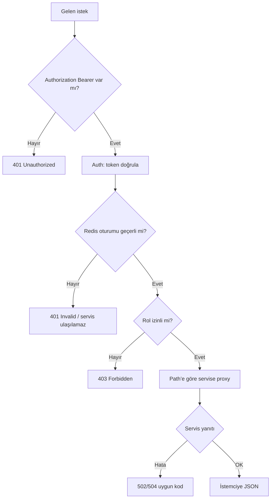
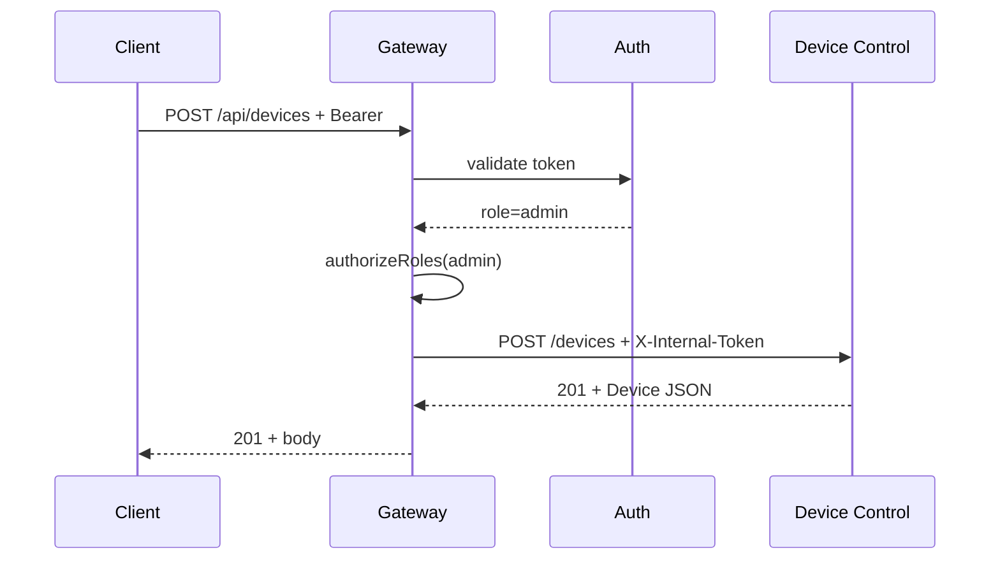

# Akıllı Ev — Mikroservis ve API Gateway (Dispatcher)

| | |
|---|---|
| **Ders** | Yazılım Geliştirme Laboratuvarı II — Proje I |
| **Proje adı** | Akıllı Ev Mikroservis Sistemi |
| **Ekip üyeleri** | *[Oğuzhan ATILKAN ]*, *[Emre GEYİKÇİOĞLU]* |
| **Tarih** | 5 Nisan 2026 |

---

## 1. Giriş: problemin tanımı ve amaç

Modern yazılım sistemlerinde **mikroservis mimarisi**, işlevleri bağımsız ölçeklenebilir birimlere ayırarak bakım ve dağıtım kolaylığı sağlar. Bu projede, dış dünyadan gelen tüm HTTP trafiğinin tek bir giriş noktasından yönetildiği bir **Dispatcher (API Gateway)** tasarlanmış ve uygulanmıştır.

**Amaçlar:**

- İstekleri URL yapısına göre ilgili mikroservislere **yönlendirmek**.
- **Yetkilendirmeyi merkezi** olarak Gateway üzerinden yapmak; oturum ve rol bilgisinin **NoSQL** (Redis) üzerinden doğrulanmasını sağlamak.
- Mikroservislerin yalnızca **iç ağdan** ve **paylaşılan gizli anahtar** (`X-Internal-Token`) ile erişilebilir olmasını sağlayarak **ağ izolasyonu** (network isolation) uygulamak.
- Trafik ve yönetim işlemlerini **loglamak**, hata durumlarında **doğru HTTP durum kodlarını** (4xx/5xx) dönmek (her hata için yapay olarak `200 OK` dönülmez).
- Dispatcher bileşeninde **Test-Driven Development (TDD)** disiplinini (Red–Green–Refactor) kullanmak.
- Sistemi **Docker Compose** ile tek komutta ayağa kaldırmak; **Grafana** ile trafiği görselleştirmek; **k6** ile yük testi yapmak.

**Senaryo:** Yoğun kullanıma açık bir **akıllı ev** senaryosu — cihaz yönetimi ve telemetri okuma/yazma işlemleri ayrı mikroservislerde modellenmiştir.

**Teslim ve süreç (ödev koşulları):** Proje **2 kişilik gruplar** halinde yürütülmüştür. GitHub’da **ekip üyelerinin eşit ve düzenli commit dağılımı** değerlendirme için zorunludur (grafik veya `git shortlog -sn` çıktısı rapora eklenebilir). Dispatcher için **TDD** uygulandığı, test dosyalarının **işlevsel koddan önce** yazıldığı **Git tarih damgaları** ile gösterilmelidir.

---

## 2. Literatür ve kavramlar

### 2.1 REST ve Richardson Olgunluk Modeli (RMM)

**REST**, kaynakların URI ile tanımlandığı ve işlemlerin uygun **HTTP metotları** ile yapıldığı bir mimari stildir. **Richardson Maturity Model** genelde dört seviye ile özetlenir:

| Seviye | Özet |
|--------|------|
| 0 | Tek uç nokta, HTTP tüneli |
| 1 | Kaynaklar (URI) |
| 2 | HTTP fiilleri (GET/POST/PUT/DELETE) ve durum kodları |
| 3 | HATEOAS (yanıtlarda bağlantılar) |

Bu projede API tasarımı **en az RMM Seviye 2** ile uyumludur: kaynaklar path ile ifade edilir; silme/güncelleme gibi işlemler **DELETE/PUT** ile yapılır; `POST /api/deleteDevice?id=1` gibi **RPC-stili** tek uç nokta kullanılmaz. *(Seviye 3 — HATEOAS — isteğe bağlıdır; uygulanırsa +5 puan.)*

### 2.2 Mikroservis ve API Gateway

**Mikroservisler** bağımsız deploy edilebilen servislerdir; **API Gateway** dış istemciler için tek giriş noktasıdır, yönlendirme, güvenlik ve gözlemlenebilirlik burada toplanır. Kaynak: [microservices.io](https://microservices.io/).

### 2.3 TDD (Test-Driven Development)

**Red → Green → Refactor** döngüsü: önce test yazılır (kırmızı), minimal kod ile geçirilir (yeşil), ardından yapı iyileştirilir. Dispatcher (Gateway) için birim testleri **Jest** ile yazılmıştır.

---

## 3. Sistem tasarımı ve mimari

### 3.1 Birimler (en az dört bağımsız ünite)

| Ünite | Rol | Not |
|--------|-----|-----|
| **Gateway (Dispatcher)** | Tek dış port; yönlendirme, oturum token doğrulama (Auth + Redis), rol kontrolü, proxy, metrik, erişim logu | TDD ile geliştirilmiş testler |
| **Auth Service** | Kayıt, giriş, token doğrulama, çıkış | MongoDB (kullanıcı), Redis (oturum) |
| **Device Control Service** | Cihaz CRUD ve komut gönderme | MongoDB |
| **Telemetry Service** | Telemetri okuma/yazma | MongoDB |

**NoSQL kullanımı:** MongoDB (belge tabanlı) ve Redis (oturum/erişim verisi) gerçek veritabanı motorlarıdır; JSON dosyası ile sahte kalıcı katman kullanılmamıştır. Gateway’in kalıcı verisi diğer servislerden **mantıksal olarak ayrıdır**; yetki doğrulaması Auth servisi + Redis oturumları üzerinden merkezi yürütülür.

### 3.1.1 Depo (repository) modül yapısı

Aşağıdaki yapı, ödev metninde istenen **modüllerin ve klasör hiyerarşisinin** özetidir (`smart-home-microservices` kökü).

```text
smart-home-microservices/
├── apps/
│   ├── gateway/           # Dispatcher (API Gateway), Jest testleri: tests/
│   ├── auth-service/
│   ├── devicecontrol-service/
│   └── telemetry-service/
├── infra/                 # Prometheus, Grafana, Loki, Promtail, log dizini
├── load-test.js           # k6 yük testi
├── docker-compose.yml
└── package.json           # workspace betikleri (test, k6)
```

### 3.2 Yüksek seviye mimari (Mermaid)



### 3.3 İstek akışı — oturum ve korumalı kaynak (sequence)



### 3.4 Ağ izolasyonu

- Dışarıya yalnızca **Gateway** portu (`3000`) açılır; mikroservis konteynerleri Compose içinde **publish edilmez**.
- Mikroservis uçları, `X-Internal-Token` başlığı doğrulanmadan işleme alınmaz; doğrudan dış istek reddedilir (**403**).

### 3.5 Gateway’de nesne yönelimli yapı (özet sınıf diyagramı)



**SOLID özeti:** doğrulama arayüzü (`IAuthTokenValidator`) ile **tek sorumluluk** ve **bağımlılığın soyutlamaya yönlendirilmesi**; proxy seçenekleri için ayrı fabrika sınıfı.

### 3.5.1 Mikroservislerde örnek sınıf/katman yapısı (Device Control)

Ödev metninde istenen **mikroservis sınıf yapıları** için tipik katman; diğer servislerde de route → service → model ayrımı benzerdir.



### 3.6 Veri tabanı — kavramsal veri modeli (E-R)

MongoDB fiziksel olarak **üç ayrı veritabanı** kullanır (`authdb`, `devicecontroldb`, `telemetrydb`); Redis oturumları klasik E-R ile gösterilmez, metin olarak not düşülür. Aşağıdaki şema **mantıksal** varlıkları ve telemetri–cihaz bağını gösterir.



**Redis (NoSQL):** `session:<token>` anahtarında JSON oturum (`userId`, `username`, `role`); süre dolunca anahtar silinir.

### 3.7 Algoritma — yönlendirme ve yetki (akış)



**Karmaşıklık (kabaca):** Token doğrulama Redis üzerinde **O(1)** okuma; path bazlı yönlendirme sabit kural kümesi için **O(1)**; proxy tarafında istek başına sabit sayıda ağ çağrısı.

### 3.8 İkinci sequence — cihaz oluşturma (örnek)



---

## 4. REST / RMM uyumu — örnek kaynaklar

| Kaynak / işlem | Metot | Açıklama |
|----------------|-------|----------|
| `/api/devices` | GET, POST | Cihaz listesi / oluşturma |
| `/api/devices/:id` | GET, PUT, DELETE | Tekil cihaz |
| `/api/devices/:id/commands` | POST | Komut gönderme |
| `/api/telemetry` ve alt path’ler | GET, PUT, … | Telemetri (rol kısıtlı) |

Hata yanıtları **gerçek HTTP kodları** ile döner; Gateway testlerinde örneğin ulaşılamayan servis için **502** doğrulanır.

---

## 5. Docker ve çalıştırma

Proje kökünde (`smart-home-microservices`):

```bash
docker compose up --build
```

- **API:** `http://localhost:3000`
- **Grafana:** `http://localhost:3005` (varsayılan: `admin` / `admin`)
- **Prometheus:** `http://localhost:9099`
- **k6 → InfluxDB** (Grafana veri kaynağı): `load-test.js` içindeki yönergeye göre

Gateway testleri (yerel):

```bash
npm install
npm run test --workspace=apps/gateway
```

Yük testi (k6 yüklü olmalı; stack ayaktayken):

```bash
npm run k6
# veya Influx + Grafana paneli için:
npm run k6:influx
```

---

## 6. Gözlemlenebilirlik: Grafana ve log tablosu

Ödev metni, Dispatcher trafiğinin **grafiksel arayüz** (Grafana vb.) ile sunulmasını ve **detaylı log tablosu** ile desteklenmesini ister.

- **Prometheus:** Gateway `GET /metrics` uç noktasını periyodik çeker (`infra/prometheus/prometheus.yml` içinde `gateway:3000`).
- **Loki + Promtail:** `infra/logs/gateway-access.log` dosyası ve (Docker socket erişimi olan ortamlarda) konteyner logları; Grafana **Explore** → **Loki** ile **tablo** görünümünde satır satır sorgulanabilir.
- **Grafana:** Üç veri kaynağı provision edilir: **InfluxDB (k6)**, **Prometheus**, **Loki**. **Önemli:** Hazır içe aktarılan JSON dashboard yalnızca **K6** klasöründedir (`k6-gateway.json`). Gateway trafik grafiği için **Explore → Prometheus** ile örneğin histogram `gateway_http_request_duration_seconds` veya `gateway_instance_info` üzerinden panel oluşturup kaydedin; **Yer 5** ekran görüntüsü bununla alınabilir.

Aşağıdaki **ekran görüntüsü** bölümlerine kendi görüntülerinizi ekleyin (repoya `screenshots/` klasörü koyup Markdown görsel satırlarını kullanabilirsiniz). **Yer 5** grafik/metrik, **Yer 5b** log tablosu (Explore) için ayrılmıştır.

---

## 7. Test senaryoları ve sonuçlar

### 7.1 TDD — Gateway (Jest)

| Senaryo | Beklenti | Dosya referansı |
|---------|----------|-------------------|
| Korumalı rota, token yok | 401 | `apps/gateway/tests/auth.test.ts` |
| Token var, rol yetersiz | 403 | aynı |
| Geçerli admin token ile telemetri | 200 | aynı |
| `/api/devices` ve telemetri yönlendirme | 200, doğru servis | `proxy.test.ts` |
| Ulaşılamayan servis | 502 | `proxy-error.test.ts` |

*Not: Ödev metninde istenen üzere Dispatcher test dosyalarının geliştirme sürecinde **işlevsel koddan önce** yazılmış olması gerekir; teslimde bu sıra Git geçmişi ile gösterilmelidir.*

### 7.2 Yük testi (k6)

Script: `load-test.js`. Aşamalar: **50 → 100 → 200 → 500** eşzamanlı kullanıcı kademeleri; giriş + `/api/devices` senaryosu.

Özet çıktı tam kademeli koşuda `k6-summary.json` dosyasına yazılır. **README tablosundaki her satır** (50 / 100 / 200 / 500) için ayrı ölçüm gerekir; `load-test.js` içinde `K6_TIER` ortam değişkeni ile sabit VU modu kullanılır (her kademe ~90 sn).

**Tabloyu doldurma:** Docker stack ayaktayken proje kökünde:

```bash
npm run k6:tiers
npm run k6:table
```

`k6:table` komutu, `k6-summary-tier-50.json` … `500.json` dosyalarından üretilen Markdown satırlarını terminale yazar; aşağıdaki tablonun gövdesine yapıştırın. (Tek başına tam kademeli `npm run k6` özeti tüm aşamaları birleştirir; satır satır tablo için `k6:tiers` şarttır.)

#### Tablo — k6 sonuçları (`npm run k6:table` çıktısı ile doldurun)

| Eşzamanlı kullanıcı (yaklaşık) | Ortalama yanıt süresi (ms) | p(95) (ms) | Hata oranı (%) | Not |
|-------------------------------|----------------------------|------------|----------------|-----|
| 50 | *[doldur]* | *[doldur]* | *[doldur]* | *[doldur]* |
| 100 | *[doldur]* | *[doldur]* | *[doldur]* | *[doldur]* |
| 200 | *[doldur]* | *[doldur]* | *[doldur]* | *[doldur]* |
| 500 | *[doldur]* | *[doldur]* | *[doldur]* | *[doldur]* |

---

## 8. Sonuç ve tartışma

**Başarılar:** Mikroservis ayrımı, merkezi yetkilendirme, Docker ile tek komutla orkestrasyon, NoSQL ile veri izolasyonu, Gateway’de TDD ve otomatik testler, k6 ile ölçülebilir yük testi, Grafana ile görselleştirme.

**Sınırlılıklar:** Üretim için TLS sonlandırma, rate limiting, merkezi kimlik sağlayıcı (OAuth2/OIDC) ve HATEOAS (RMM 3) genişletmeleri eklenebilir.

**Olası geliştirmeler:** Circuit breaker, dağıtık izleme (trace ID), çoklu örnek Gateway arkasında load balancer, güvenlik taraması ve CI pipeline.

---

## 9. Değerlendirme ölçütleri ile eşleme (özet)

| Kriter | Projede karşılığı |
|--------|-------------------|
| Dispatcher işlevselliği | URL bazlı proxy, auth, rol, hata kodları |
| TDD | Gateway Jest testleri |
| Mikroservis ve veri izolasyonu | Ayrı servisler, ayrı Mongo koleksiyonları/DB, Redis oturumları |
| RMM | REST kaynakları ve HTTP fiilleri |
| Docker | `docker compose up` |
| Görselleştirme | Grafana, Prometheus, Loki |
| OOP | Arayüzler, sınıflar, middleware ayrımı |
| Veri tabanı | MongoDB + Redis |
| Test ve hata yönetimi | Jest, k6, anlamlı HTTP kodları |
| Rapor | Bu `README.md` |

---

## Ekran görüntüsü yerleri *(buraya yapıştırın / dosya yolu verin)*

Aşağıdaki her blokta **tek bir görsel** için yer vardır. Kullanım: projede `screenshots` klasörü oluşturup `` şeklinde ekleyebilir veya GitHub arayüzünde dosyayı yükleyip bağlantıyı kullanabilirsiniz.

---

### 📷 Yer 1 — Docker Compose: tüm servislerin çalıştığı terminal veya Docker Desktop

<!-- SCREENSHOT: docker-compose-up -->


---

### 📷 Yer 2 — Gateway sağlık veya dışarıdan erişilen tek giriş noktası (ör. Postman / curl `GET /health`)

<!-- SCREENSHOT: gateway-health -->


---

### 📷 Yer 3 — Ağ izolasyonu: mikroservise doğrudan port olmadan erişilemediğini gösteren deneme (ör. `curl` ile iç IP/port yok; sadece gateway :3000)

<!-- SCREENSHOT: network-isolation -->


---

### 📷 Yer 4 — Login ve Bearer token ile korumalı istek (Postman veya benzeri)

<!-- SCREENSHOT: auth-flow -->


---

### 📷 Yer 5 — Grafana: Prometheus / Gateway trafiği veya istek süresi **grafiği**

<!-- SCREENSHOT: grafana-metrics-chart -->


---

### 📷 Yer 5b — Grafana **Explore**: Loki sorgusu ile **detaylı log tablosu** (method, path, status, süre)

<!-- SCREENSHOT: grafana-loki-log-table -->


---

### 📷 Yer 6 — Grafana: k6 / InfluxDB yük testi paneli (`npm run k6:influx` sonrası)

<!-- SCREENSHOT: grafana-k6 -->


---

### 📷 Yer 7 — k6 konsol özeti veya oluşan `k6-summary.json` içinden kesit

<!-- SCREENSHOT: k6-console-or-json -->


---

### 📷 Yer 8 — Jest test çıktısı (`npm run test --workspace=apps/gateway`)

<!-- SCREENSHOT: jest-gateway -->


---

### 📷 Yer 9 — (İsteğe bağlı) MongoDB Compass veya `mongosh` ile koleksiyon örneği (veri izolasyonu)

<!-- SCREENSHOT: mongodb-example -->


---

### 📷 Yer 10 — (İsteğe bağlı) Redis içinde oturum anahtarı örneği (`session:...`)

<!-- SCREENSHOT: redis-session -->


---

## Ekler ve kaynaklar

- [Markdown Guide](https://www.markdownguide.org/)
- [Mermaid](https://github.com/mermaid-js/mermaid)
- [TDD](https://www.geeksforgeeks.org/software-engineering/test-driven-development-tdd/)
- [Microservices](https://microservices.io/)
- [Docker Compose up](https://docs.docker.com/reference/cli/docker/compose/up/)
- [Richardson Maturity Model](https://restfulapi.net/richardson-maturity-model/)
