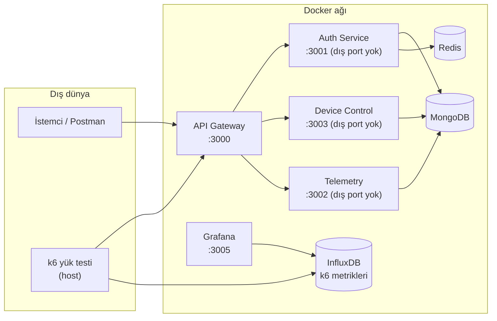
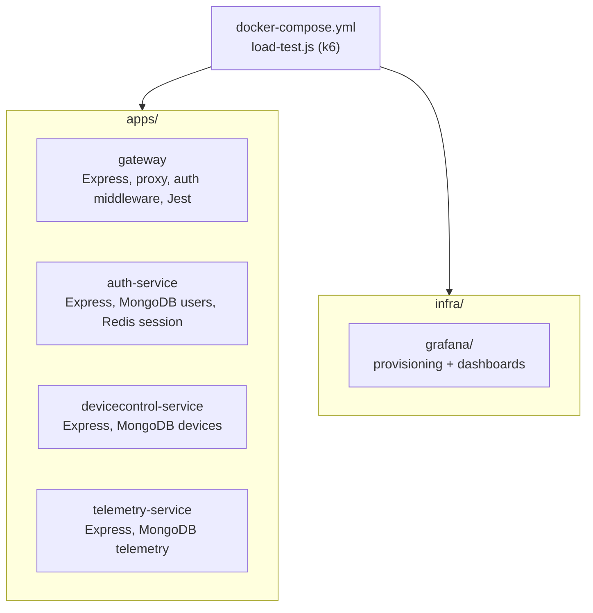
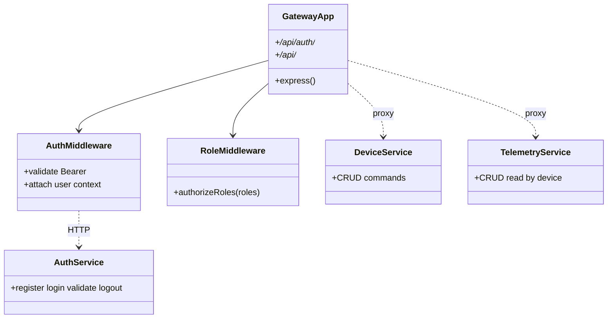
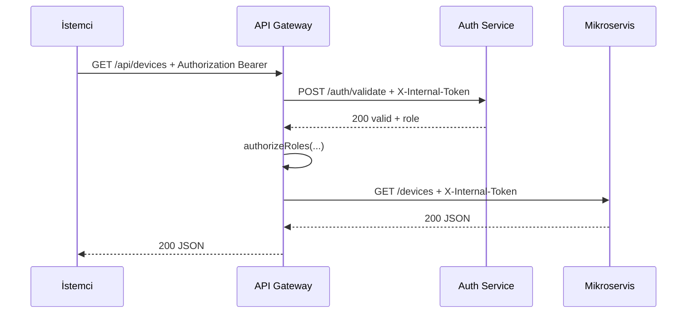

# Akıllı Ev — Mikroservis Mimarisi ve API Gateway (Dispatcher)

## 1. Kapak bilgileri

| | |
|---|---|
| **Ders** | Yazılım Geliştirme Laboratuvarı-II — Proje I |
| **Proje adı** | Akıllı Ev Mikroservis Sistemi ve API Gateway |
| **Ekip üyeleri** | *[Ad Soyad 1], [Ad Soyad 2]* |
| **Tarih** | *[Teslim / rapor tarihi]* |

---

## 2. Giriş: problem, amaç ve kapsam

Modern yazılım sistemlerinde istemcilerin her mikroservise doğrudan erişmesi güvenlik, sürümleme ve trafik yönetimi açısından risk oluşturur. Bu proje, **tek giriş noktası** olarak bir **Dispatcher (API Gateway)** kullanarak dış istekleri merkezden yönlendirmeyi; **oturum ve yetkilendirmeyi** gateway üzerinden konsolide etmeyi; **yoğun trafik senaryosu** altında sistemin davranışını ölçmeyi amaçlar.

**Hedefler (özet):**

- En az dört bağımsız birim: gateway, kimlik doğrulama servisi ve en az iki işlevsel mikroservis.
- Tüm dış trafiğin gateway üzerinden geçmesi; mikroservislerin doğrudan dış erişime kapalı olması (Docker ağı + uygulama içi iç token).
- NoSQL veri depolarının servis bazında izole kullanımı (MongoDB veritabanları, Redis oturum).
- REST API’lerin **Richardson Olgunluk Modeli (RMM) Seviye 2** ile uyumlu tasarlanması (kaynak URI, doğru HTTP metotları ve durum kodları).
- Gateway geliştirmesinde **TDD (Red–Green–Refactor)** disiplini.
- **Docker Compose** ile tek komutta ayağa kalkabilen mimari.
- **k6** ile yük testi; **InfluxDB + Grafana** ile sonuçların görselleştirilmesi.

---

## 3. Kavramsal çerçeve

### 3.1 Mikroservis mimarisi

Mikroservis yaklaşımında sistem, sınırları net **iş yeteneklerine** göre ayrı deploy edilebilir servislere bölünür. Servisler gevşek bağlıdır; iletişim genelde **HTTP/JSON** ile yapılır. Kaynak: [microservices.io](https://microservices.io/).

### 3.2 API Gateway (Dispatcher)

Gateway, istemci ile arka uç servisler arasında **tek giriş** sağlar: yönlendirme, kimlik doğrulama sonrası yetki kontrolü, hata ve zaman aşımı yönetimi burada toplanır.

### 3.3 REST ve Richardson Olgunluk Modeli (RMM)

**REST**, kaynakların URI ile tanımlanması ve durum geçişlerinin HTTP semantiğiyle ifade edilmesini öngörür. **RMM Seviye 2**: kaynaklar için **POST / GET / PUT / DELETE** gibi uygun metotlar; **4xx / 5xx** ile anlamlı hata kodları; “tek POST ile sil” veya `.../delete?id=` gibi RPC tarzı tasarımdan kaçınılması ([RESTful API — RMM](https://restfulapi.net/richardson-maturity-model/)).

Bu projede örnekler:

- Cihazlar: `GET /api/devices`, `GET /api/devices/:id`, `POST /api/devices`, `PUT /api/devices/:id`, `POST /api/devices/:id/commands`.
- Telemetri: `GET /api/telemetry`, `POST /api/telemetry`, `GET /api/telemetry/:id`, `PUT /api/telemetry/:id`, `DELETE /api/telemetry/:id`.

### 3.4 Test Odaklı Geliştirme (TDD)

Gateway için önce birim/entegrasyon testleri (ör. Jest + Supertest) yazılmış, ardından uygulama kodu testleri geçecek şekilde geliştirilmiştir. Döngü: **Red → Green → Refactor** ([TDD giriş](https://www.geeksforgeeks.org/software-engineering/test-driven-development-tdd/)).

---

## 4. Sistem tasarımı ve mimari

### 4.1 Genel mimari (bileşen diyagramı)



**Ağ izolasyonu:** `docker-compose` ile mikroservis HTTP portları host’a yayınlanmaz; yalnızca gateway (ve Grafana/Influx/DB geliştirme portları) dışarı açılır. Gateway, arka uç çağrılarına `X-Internal-Token` ekler; servisler bu başlığı doğrulamadan işlemi sürdürmez.

### 4.2 Modül / paket yapısı



### 4.3 Veri izolasyonu (NoSQL)

| Birim | Veri deposu | Açıklama |
|--------|-------------|----------|
| Auth | MongoDB `authdb` | Kullanıcı kayıtları (şifre hash), rol |
| Auth | Redis | Oturum token → kullanıcı/rol |
| Device Control | MongoDB `devicecontroldb` | Cihaz dokümanları |
| Telemetry | MongoDB `telemetrydb` | Ölçüm kayıtları |
| k6 | InfluxDB `k6` | Yük testi zaman serisi metrikleri |

Dispatcher’ın kalıcı iş verisi için ayrı bir veritabanı şeması, auth ve diğer servislerden **mantıksal olarak ayrılmıştır** (gateway yalnızca HTTP ile konuşur).

### 4.4 Sınıf / katman yapısı (özet)

Her serviste tipik katmanlar: **route (HTTP)** → **service (iş kuralları)** → **model / DB**. Gateway’de: **middleware** (`authMiddleware`, `authorizeRoles`), **proxy route**’ları, **auth proxy** (axios). Bu yapı tek sorumluluk ve test edilebilirlik için uyumludur.



### 4.5 İş akışı: korumalı istek (sequence)



### 4.6 Karmaşıklık (kabaca)

- Token doğrulama: Redis `GET` ile **O(1)** (oturum anahtarı).
- Cihaz/telemetri listeleri: MongoDB taraması **O(n)** (koleksiyon büyüklüğüne bağlı); üretimde indeks ve sayfalama önerilir.
- Gateway yönlendirme: sabit path eşlemesi **O(1)**.

---

## 5. Güvenlik ve hata yönetimi

- **401**: Bearer yok/geçersiz.
- **403**: Rol yetersiz veya iç servis token’ı hatalı (doğrudan mikroservis erişimi reddi).
- **404**: Kaynak bulunamadı.
- **502**: Arka uç ulaşılamaz (ör. test rotası veya servis kapalı).
- Hatalarda **HTTP durum kodu** kullanılır; “her zaman 200 + JSON error” yaklaşımı kullanılmaz (ödev şartı ile uyumlu).

---

## 6. Testler

### 6.1 Gateway — TDD

- **Araç:** Jest, Supertest, axios mock, proxy mock.
- **Örnek kapsam:** Kimlik doğrulama middleware (401/403), proxy yönlendirme, 502 hata yolu.
- **Not:** İstenen disiplin için test dosyalarının sürüm kontrolünde üretim kodundan **önce** commitlendiği git geçmişi ile gösterilmelidir.

### 6.2 Manuel / API testleri

- Postman ile login, rol bazlı erişim, cihaz ve telemetri uçları.

### 6.3 Yük testi (k6)

- **Senaryo:** `load-test.js` — aşamalı **50 → 100 → 200 → 500** sanal kullanıcı (VU); her kademede ısınma ve sabit süre.
- **Metrik çıktısı:** `k6 run --out influxdb=http://localhost:8086/k6 load-test.js`
- **Özet dosyası:** Çalışma sonunda `k6-summary.json` (ortalama, p95, hata oranı rapora yapıştırılabilir).
- **Görselleştirme:** Grafana `http://localhost:3005` — hazır **K6** klasöründeki dashboard; isteğe bağlı **Table** paneli ile tablo görünümü.

*[Rapor PDF’ine: Grafana ekran görüntüsü ve k6-summary.json’dan tablo ekleyin.]*

---

## 7. Çalıştırma

```bash
# Tüm stack
docker compose up --build

# Gateway (dış erişim)
# http://localhost:3000

# Grafana (varsayılan admin/admin — üretimde değiştirin)
# http://localhost:3005

# k6 (host’ta k6 kurulu olmalı)
npm run k6:influx
```

---

## 8. Ekran görüntüleri (eklenecek)

PDF ve ödev metni gereği aşağıdakiler rapor PDF’ine veya bu repoya görsel olarak eklenmelidir:

1. Docker Compose ile çalışan servisler (`docker compose ps` veya Docker Desktop).
2. Postman: login + Bearer ile korumalı istek.
3. Ağ izolasyonu: host’tan mikroservis portlarına erişilemediğinin gösterimi; yalnızca gateway erişimi.
4. Grafana: k6 dashboard (VU ve süre grafikleri) ve varsa tablo paneli.
5. (İsteğe bağlı) Gateway test çıktısı — `npm run test --workspace=apps/gateway`.

---

## 9. Sonuç ve tartışma

### Başarılar

- Merkezi gateway, rol tabanlı yetkilendirme ve iç servis doğrulaması ile ödevde istenen **izolasyon ve güvenlik** hedeflerine uyum.
- RMM Seviye 2 ile uyumlu HTTP tasarımı; telemetride **PUT/DELETE** ile kaynak yaşam döngüsü genişletildi.
- Docker ile tekrarlanabilir dağıtım; k6 + Influx + Grafana ile **profesyonel yük testi ve görselleştirme** zinciri.

### Sınırlılıklar

- Gateway üzerindeki **her isteğin kalıcı merkezi log tablosu** ve ayrı bir “trafik log UI” tam kapsamlı uygulanmadıysa raporda açıkça belirtilmeli; geliştirme olarak Loki/Elastic veya Mongo log koleksiyonu önerilebilir.
- Cihaz silme (**DELETE /devices/:id**) iş kuralı olarak eklenmediyse RMM tam CRUD açısından sınırlılık olarak yazılabilir.
- k6 eşikleri ve VU süreleri donanıma göre ayarlanmalıdır.

### Olası geliştirmeler

- JWT veya refresh token; rate limiting; merkezi yapılandırma (Consul vb.).
- RMM Seviye 3 (HATEOAS) ile bağlantılı kaynaklar.
- Prometheus + Grafana ile runtime metrikleri; yapılandırılmış gateway erişim logları.

---

## 10. Kaynaklar (ödev ekinde önerilen bağlantılar)

- [Markdown Guide](https://www.markdownguide.org/)
- [Mermaid](https://github.com/mermaid-js/mermaid)
- [TDD](https://www.geeksforgeeks.org/software-engineering/test-driven-development-tdd/)
- [Microservices](https://microservices.io/)
- [Docker Compose up](https://docs.docker.com/reference/cli/docker/compose/up/)
- [Richardson Maturity Model](https://restfulapi.net/richardson-maturity-model/)

---

*Bu belge Kocaeli Üniversitesi Yazılım Geliştirme Laboratuvarı-II Proje I rapor şablonuna göre düzenlenmiştir. Kişisel alanları (`[...]`) ve görselleri ekip tamamlamalıdır.*
